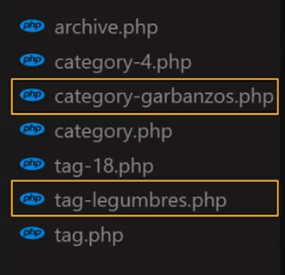
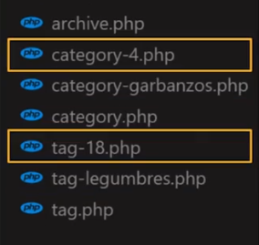

# Curso Profesional Wordpress
Curso profesional wordpress - platzi

Vamos a utilizar la herramienta flywheel para instalar wordpress en nuestro computador,
Flywheel instala maquinas virtuales para correr el wp que vamos a crear, ademas tiene la opcione de crear un wp en base a otro que se haya creado a esto se le llama "Blueprint".

Ademas nos permite customizar el wp, escogiendo:
1. version php.
2. version de base de datos

¿Que es un Blueprint?
Es una imagen que nosotros guardamos de una maquina virtual anterior que tiene un determinado estado
¿Cual es su uso mas común?
Que nosotros creemos una instalación basica de wp con todas nuestras opciones preseteadas y la guardemos, cada vez que nosotros utilizemos ese blueprint podamos tener una maquina con todas las opciones cargadas.

# 1. ¿Cómo se crea y se personaliza una categoría en Wordpress?
Para ver esto tenemos que pensar que wp es como una tienda, en donde tenemos distintos estantes y gondolas que cada una de ellas contiene distintos embases y dentro de los embases estan los distintos productos, todo eso en wp se representa con taxonomias, terminos y posts

Nosotros vamos a tener una taxonimas, que es un agrupamiento de terminos y unos terminos que son agrupamientos de contenido(posts), esos terminos son los que van a estructurar el sitio y son las diferentes categorias.

## 1.1 Taxonomías por defecto
wp tiene dos taxonomías por defecto
1. Category (categorias): Se aplica al post type "post" y permite agruparlos de forma jerárquica.
2. Tag (Etiquetas): Se aplica al post type "post" y permite agruparlos pero de forma no jerarquizada.

La única difencia que hay entre ellas es que las categorias nos permite ordenar contenido jerárquicamente, es decir que nos permite generar categorias y sub-categorias, mientras que las etiquetas solo contiene contenido y no estan relacionadas entre sí 

## 1.2 ¿Qué archivos sirven para organizar la información?

Jerarquia de archivos:
1. La primera jerárquia de archivos que se tendra en cuenta es la de los archivos que contengan el slug (nombre que le pusimos al termino que contienen que contiene los post) de los terminos 
2. La siguiente jerárquia de archivos es el nombre de la taxonomia mas el id de la taxonomias, que es otra forma de organizarlo puesto que cada archivo tiene un id en particular. 
3. Finalmente en caso de no encotrarlos, buscará el archivo generíco de las categorías y las etiquetas. 
4. En caso de no encontrar ningún archivo definido para las taxonomias se dirigirá al PHP por defecto para todos los archivos   
